<picture>
  <source media="(prefers-color-scheme: dark)" srcset="assets/hero-dark.svg">
  
</picture>

I build web products end to end: chat bots on WhatsApp, React interfaces, the
Postgres underneath. Lately most of my time goes into one problem: making AI
coding agents dependable enough to hand real work to. Steps you can read,
results you can measure, a stop button that works.

[LinkedIn](https://linkedin.com/in/matteodimattia)

## Ship's log · what I'm building

**[sailor](https://github.com/SIRTHEO/sailor)** · Rust · work in progress 
Makes the command-line coding agents you already use work together, inside
flows you can read, measure and stop.

<!-- log:start -->
> **Latest log entry** · Sep 9, 2026 · [Merge: a person can approve or reject a step that is waiting for them](https://github.com/SIRTHEO/sailor/commit/fbabb4529b96cf85a79fee4fade865981cc48cde)
<!-- log:end -->

## Bearings · how I work

- **Measure before deciding.** A number beats an opinion. Two identical numbers
  usually mean the change never ran.
- **Fix the cause, not the symptom.** No cleanup job for a mess that should not
  have been made in the first place.
- **Leave the lines tidy.** Code and commits written for whoever comes aboard
  in six months. Usually me.

## In the hold · tools

| | |
|---|---|
| Languages | Rust · TypeScript · Lua |
| Web & data | React · TanStack · Node · Postgres · Supabase · Prisma |
| Build & design | Docker · GitHub Actions · Figma |

## Ashore · off hours

Gamer and modder. I optimize systems for fun, real and virtual.

<picture>
  <source media="(prefers-color-scheme: dark)" srcset="assets/tide-dark.svg">
  
</picture>

Everything on this page is drawn by two small scripts in this repo and redrawn every night. No third-party widgets.
