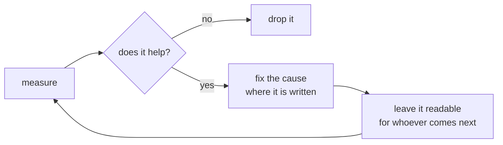

<picture>
  <source media="(prefers-color-scheme: dark)" srcset="assets/intro-dark.svg">
  
</picture>

I ship products end to end and then build the tooling that keeps them honest:
dev environments that start with one command, pipelines that fail for the
right reason, AI agents that do real work inside flows someone can read,
measure and stop. I care more about why something broke than about the patch.

[LinkedIn](https://linkedin.com/in/matteodimattia)

## What I do

- **Products, end to end.** Conversational bots on the WhatsApp Cloud API,
  LLM-driven matching workflows, React frontends, and the Postgres underneath.
- **Tooling for coding agents.** Harnesses, hooks, code intelligence with
  semantic and graph search, multi-agent orchestration. I benchmark whether
  it actually helps before keeping it.
- **Infrastructure and developer experience.** Local stacks with a single
  entry point, tunnels, CI/CD, container deploys, product analytics.
- **Design systems.** Tokens, typography, motion, from Figma to components.
- **Data.** Schema design, migrations, query tuning, auth and role models.

## Now

**[sailor](https://github.com/SIRTHEO/sailor)** · work in progress
Make the command-line agents you already have cooperate inside flows you can
read, measure and stop. Written in Rust.

## How I work

## Stack

Rust · TypeScript · Lua · React / TanStack · Node · Postgres / Supabase / Prisma ·
Docker · GitHub Actions · Figma

## Off-screen

Gamer and modder. I optimize systems for fun, real and virtual.

<picture>
  <source media="(prefers-color-scheme: dark)" srcset="assets/contributions-dark.svg">
  
</picture>

The card and the calendar are SVGs generated by the scripts in this repo. Nothing here depends on a third-party service.
