# Matteo Di Mattia

**Full-stack engineer · SIRTHEO** 
[LinkedIn](https://linkedin.com/in/matteodimattia)

I build web products end to end, from conversational WhatsApp bots to React interfaces and Postgres databases. My main focus is making **AI coding agents reliable—and measuring how well they work**.

### Building now: [sailor](https://github.com/SIRTHEO/sailor)

A Rust project that helps the command-line agents you already use work together, with steps you can read, results you can measure, and execution you can stop. **Work in progress.**

### How I work

Measure before deciding. Fix the root cause. Write code and commits for the person reading them six months from now.

Design matters to me: consistent design systems, considered typography, and thoughtful motion. Outside work, I’m a gamer and modder.

### Tools I use

**Languages** · Rust, TypeScript, Lua 
**Web & data** · React, TanStack, Node, Postgres, Supabase, Prisma 
**Build & design** · Docker, GitHub Actions, Figma

---

<picture>
  <source media="(prefers-color-scheme: dark)" srcset="assets/contributions-dark.svg">
  
</picture>
